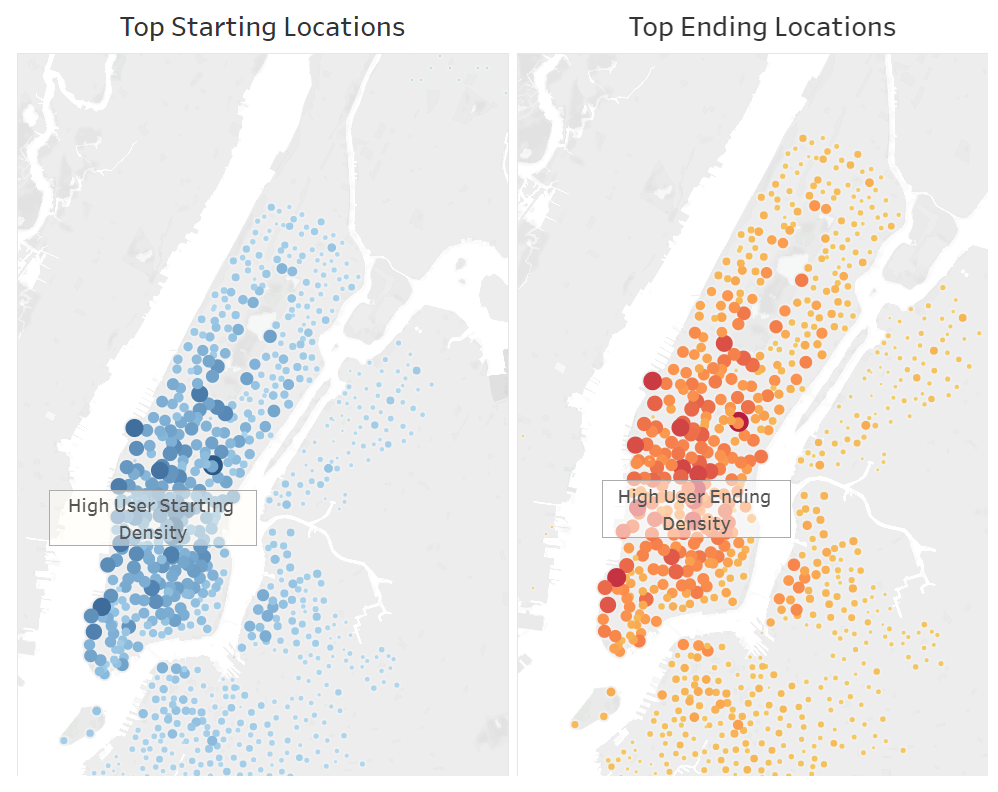

# bikesharing_challenge

## Overview
NYC Citi Bike data was downloaded and imported into Tableau to create various visualizations. The visualizations will be presented to investors to determine whether a bike-sharing program in Des Moines, Iowa is a solid business proposal. 

The Tableau story containing the visualizations can be found on the Tableau Public website:
[Link to NYC Citi Bike Story](https://public.tableau.com/app/profile/philip.leung/viz/NYCCitiBikeStory_16434743978600/NYCCitiBikeStory)

## Results
### Average Trip Duration by Age

The Average Trip Duration visualization is an analysis of the average trip duration in seconds by birth year of the user. The analysis shows that the younger the user, the longer the trip duration and the more consistency in trip duration. Conversely, the older the user, the shorter the trip duration and less consistency in trip duration (represented by the peaks and valleys for the older users).

### Checkout Times

The first Checkout Time visualization is an analysis of the count of all users and the length of time that the bikes were checked out for. The analysis was limited to the first three hours since the majority of the checkout time lasted less than one hour.

The second Checkout Time visualization is similar to the first Checkout Time visualization - rather than all users, the visualization incorporated each reported gender (male, female, and unknown). The analysis also shows that the checkout times mainly lasted less than one hour. Additionally, males would ride longer than females. Most rides typically last less than 20 minutes.

### Weekday Trips per Hour

The Trips by Weekday per Hour visualization is an analysis of the start and end time of the trip by hour based on the day of the week. The analysis shows that the most popular day of the week for a user to ride are Thursday, Friday, Saturday, and Sunday. The most popular times are in the morning at approximately 6AM-9AM and in the evening at approximately 4PM-8PM. 

### Trips by Gender and Customer Type

The Trips by Gender visualization is very similar to the trips by Weekday per Hour visualization - rather than all users, the visualization incorporated each reported gender. The analysis of the popular day and times is similar to the Trips by Weekday per Hour visualization. When considering gender, males logged more bike uses than females. Gender reported as unknown had inconclusive or consistent with no trend of popular day and times. 

The User Trips by Gender by Weekday and Customer Types visualizations is an analysis of the two types of users (Subscriber and Customer) broken day by day of the week and by gender. A customer is defined as a 24-hr pass or 3-day pass user. A subscriber is defined as an annual member.

The analyses show that more than 75% of the user is a subscriber. Male subscribers have the greatest number of bike ride and are generally consistently riders for each day of the week. The most popular days are Monday, Tuesday, Thursday, and Friday. Female subscribers follow the same trend of popular days, but have a considerably smaller number of rides. Unknown subscribers are inconclusive or consistent with no trend. All genders of the customer users are also inconclusive or consistent with no trend.  

### Top Starting and Ending Locations

The Top Starting and Ending Locations is a visualization of reported starting and ending locations with a basemap overlay. The analysis shows that the top starting and ending locations are essentially in the center of Manhattan. 

## Summary
According to the US Census (https://www.census.gov/quickfacts/desmoinescityiowa), approximately 57% of the population of Des Moines, Iowa is between the age of 18 and 65. Additionally, approximately 50% of the population is male/female. 

The Average Trip Duration analysis shows that the younger the population, the longer and more consistent the bike is used. Based on the age of Des Moines, this could potentially lead to a profitable business proposal.

For all analyses, males have the most bike rides. Since the population of Des Moines is 50/50 male and female, this may not be a good city to implement a bike sharing proposal. Perhaps a city with a higher male to female ratio would be more successful.

The Checkout Times analyses show that majority of the rides last less than 20 minutes. The Top Starting and Ending Locations analysis shows that most bike rides are centrally located. An analysis of Des Moines would need to be conducted based on whether the city is easily accessible by bike, and where all the restaurants and shops are. Are they also centrally located, accessible by bike, and can arrive by bike within approximately 20 minutes?

The Trips by Weekday and User Type analyses show that majority of the users are actually subscribers (most likely people living in NYC and not tourists). Based on the timings of high usage, it seems like users are using bikes to travel to work (during times of "rush-hour" traffic). This is demonstrated by the User Trips by Gender by Weekday. Male subscribers seem to use the bikes consistently every day of the week (mainly during Monday-Friday), it is assumed that it is being used for work. Additionally, the heatmap of Trips by Gender (Weekday per Hour) shows fewer uses during actual work hours of 9AM-5PM. Similar to the question above, an analysis would be needed to ask whether the residents of Des Moines would choose to bike to work rather than drive to work. Is it practical to bike to work based on the locations of the residence and work?

Although the analysis shows that majority of the users are subscribers, there is a large amount of the customers users that can make it profitable (demonstrated by the Trips by Weekday per Hour heatmap showing that the most popular day of the week for a user to ride are Thursday, Friday, Saturday, and Sunday). Since customers are short-term users, these are most likely tourists. An analysis would be needed to determine whether Des Moines, Iowa is a popular tourist destination.

### Future Analyses
With the given dataset, suggested future analyses would include:
- The average trip duration for each starting or ending location. This analysis would provide a better map of how far each user is riding the bikes and a radius of where they are going.  Another use could be how long a user is willing to ride to reach certain areas before relying on other modes of transportation. This could benefit the business proposal by determining how far out to have bike rental locations.

- The top starting and ending locations by gender. This is an interesting analysis since it could specifically target users and where they are most likely to ride a bike to. This could in turn help the business proposal by placing rental bike locations in specific areas of interest. Is there a specific destination or area that the users are trying to reach by bike? For example, if NYC users are mainly using it for work, then perhaps a business proposal for Des Moines should focus the bike accessibility to be near job locations.

Additional analyses would be needed to review Des Moines and determine whether the data compiled for New York City can be utilized for Des Moines.

